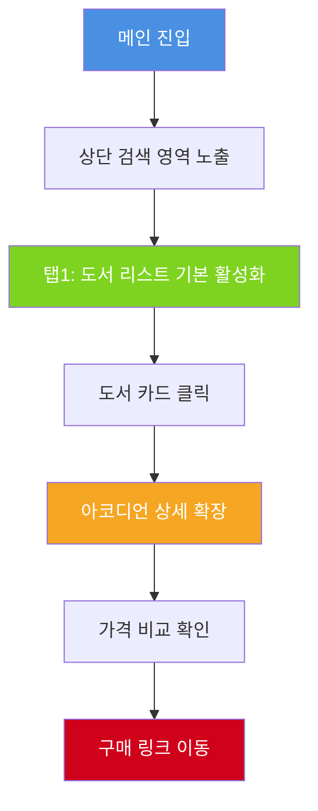
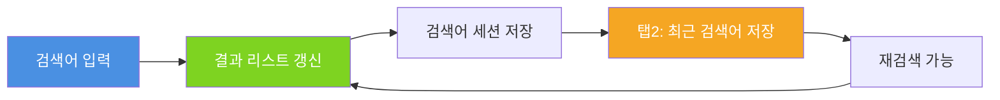
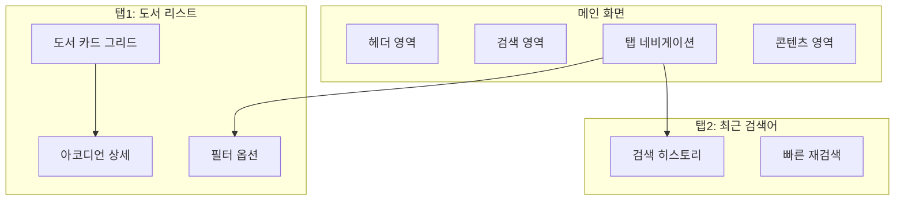
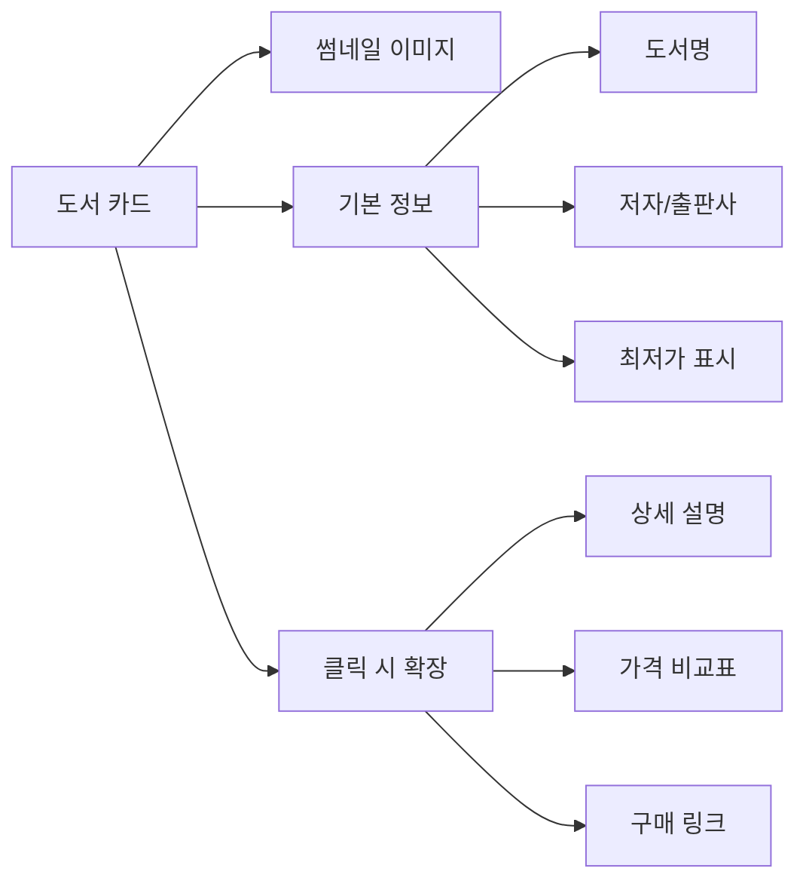
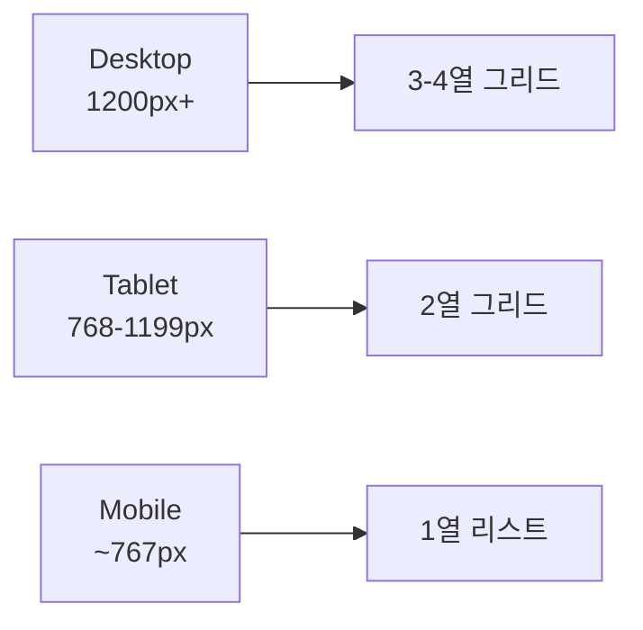
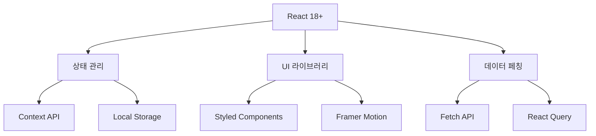
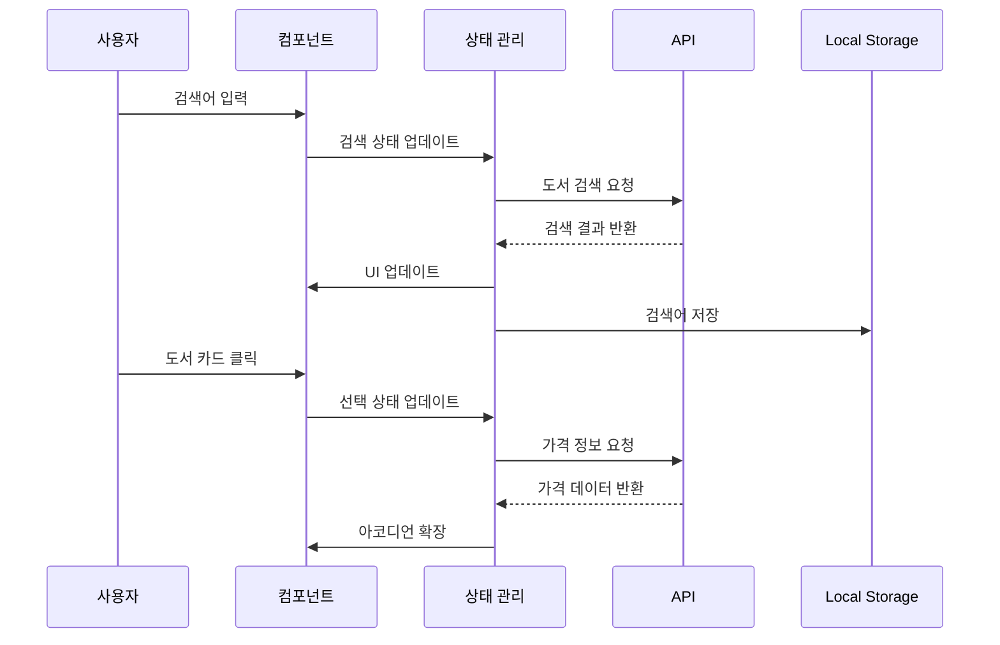

# UX 제안서 최종본
## 교육 참고서 비교 플랫폼

---

## 📋 목차

1. [화면 플로우 다이어그램](#1-화면-플로우-다이어그램)
2. [사용자 시나리오](#2-사용자-시나리오)
3. [주요 기능 명세](#3-주요-기능-명세)
4. [UI/UX 설계 원칙](#4-uiux-설계-원칙)
5. [기술 구현 방향](#5-기술-구현-방향)

---

## 1. 화면 플로우 다이어그램

### 1.1 메인 플로우



### 1.2 검색 플로우



### 1.3 화면 구조



---

## 2. 사용자 시나리오

### 시나리오 A: 신규 참고서 탐색

> [!NOTE]
> **대상 사용자**: 자녀의 학습 자료를 찾는 학부모

#### 사용자 여정

| 단계 | 사용자 행동 | 시스템 반응 | 예상 소요 시간 |
|------|------------|------------|---------------|
| 1 | 사이트 접속 | 메인 화면 로드, 검색 영역 표시 | 1-2초 |
| 2 | 과목/학제 리스트 탐색 | 필터링된 도서 카드 표시 | 즉시 |
| 3 | 도서 카드 클릭 | 아코디언 확장, 상세 정보 표시 | 0.3초 |
| 4 | 가격 비교 확인 | 여러 판매처 가격 정보 표시 | 즉시 |
| 5 | 구매처 이동 | 새 탭에서 외부 링크 오픈 | 즉시 |

#### 페인 포인트 및 해결책

```diff
- 기존 문제: 여러 사이트를 일일이 방문해야 함
+ 해결책: 한 화면에서 모든 가격 정보 비교 가능

- 기존 문제: 도서 정보가 분산되어 있음
+ 해결책: 아코디언 UI로 필요한 정보만 확장

- 기존 문제: 검색 결과가 불명확함
+ 해결책: 과목/학제별 명확한 필터링 제공
```

### 시나리오 B: 반복 검색

> [!NOTE]
> **대상 사용자**: 여러 참고서를 비교 검토 중인 사용자

#### 사용자 여정

| 단계 | 사용자 행동 | 시스템 반응 | 예상 소요 시간 |
|------|------------|------------|---------------|
| 1 | 탭2(최근 검색어) 클릭 | 검색 히스토리 표시 | 즉시 |
| 2 | 이전 검색어 확인 | 시간순 정렬된 리스트 표시 | 즉시 |
| 3 | 검색어 클릭 | 해당 검색 결과 즉시 표시 | 0.5초 |
| 4 | 결과 비교 및 분석 | - | - |

#### 주요 이점

- ⚡ **빠른 재검색**: 검색어 재입력 불필요
- 📊 **검색 패턴 파악**: 자주 찾는 도서 확인 가능
- 🔄 **워크플로우 개선**: 비교 작업 효율성 증대

---

## 3. 주요 기능 명세

### 3.1 검색 기능

#### 기본 검색
- **실시간 검색어 제안**: 입력 중 자동완성
- **검색 필터**: 과목, 학년, 출판사, 가격대
- **정렬 옵션**: 인기순, 최신순, 가격순, 평점순

#### 검색 히스토리
- **세션 저장**: 브라우저 세션 기반 저장
- **로컬 스토리지**: 최대 20개 최근 검색어 보관
- **삭제 기능**: 개별/전체 삭제 옵션

### 3.2 도서 카드 UI



#### 카드 구성 요소

| 요소 | 표시 정보 | 상호작용 |
|------|----------|---------|
| 썸네일 | 도서 표지 이미지 | 클릭 시 확대 |
| 제목 | 도서명 (최대 2줄) | 툴팁으로 전체 제목 |
| 메타 정보 | 저자, 출판사, 출판일 | - |
| 가격 배지 | 최저가 강조 표시 | 색상 코딩 |
| 확장 버튼 | 아이콘 (▼/▲) | 아코디언 토글 |

### 3.3 가격 비교 기능

> [!IMPORTANT]
> 가격 정보는 실시간 API 연동 또는 정기 크롤링을 통해 업데이트됩니다.

#### 지원 판매처
- 교보문고
- YES24
- 알라딘
- 인터파크
- 쿠팡

#### 가격 정보 표시
```
┌─────────────────────────────────┐
│ 판매처    정가    할인가   배송비 │
├─────────────────────────────────┤
│ 교보문고  15,000  13,500  무료   │
│ YES24    15,000  13,200  무료   │
│ 알라딘    15,000  13,800  2,500 │
└─────────────────────────────────┘
```

---

## 4. UI/UX 설계 원칙

### 4.1 디자인 시스템

#### 색상 팔레트

| 용도 | 색상 | HEX | 사용처 |
|------|------|-----|--------|
| Primary | 🔵 Blue | `#4A90E2` | 주요 버튼, 링크 |
| Success | 🟢 Green | `#7ED321` | 최저가 표시 |
| Warning | 🟡 Orange | `#F5A623` | 중간가 표시 |
| Danger | 🔴 Red | `#D0021B` | 높은가 표시 |
| Neutral | ⚪ Gray | `#F5F5F5` | 배경, 구분선 |

#### 타이포그래피
- **헤딩**: Pretendard Bold, 24-32px
- **본문**: Pretendard Regular, 14-16px
- **캡션**: Pretendard Light, 12px

### 4.2 반응형 디자인



### 4.3 접근성 (Accessibility)

> [!TIP]
> WCAG 2.1 AA 수준 준수를 목표로 합니다.

- ✅ 키보드 네비게이션 지원
- ✅ 스크린 리더 호환
- ✅ 명도 대비 4.5:1 이상
- ✅ 포커스 인디케이터 명확화
- ✅ ARIA 레이블 적용

---

## 5. 기술 구현 방향

### 5.1 프론트엔드 스택



### 5.2 주요 컴포넌트 구조

```
src/
├── components/
│   ├── SearchBar/
│   │   ├── SearchInput.jsx
│   │   ├── SearchSuggestions.jsx
│   │   └── SearchHistory.jsx
│   ├── BookCard/
│   │   ├── BookCard.jsx
│   │   ├── BookDetails.jsx
│   │   └── PriceComparison.jsx
│   ├── Tabs/
│   │   ├── TabNavigation.jsx
│   │   ├── BookListTab.jsx
│   │   └── HistoryTab.jsx
│   └── Layout/
│       ├── Header.jsx
│       ├── Footer.jsx
│       └── Container.jsx
├── hooks/
│   ├── useSearch.js
│   ├── useLocalStorage.js
│   └── useBookData.js
├── utils/
│   ├── priceFormatter.js
│   └── dateFormatter.js
└── styles/
    ├── theme.js
    └── globalStyles.js
```

### 5.3 성능 최적화

> [!IMPORTANT]
> 사용자 경험을 위한 필수 최적화 항목

| 기법 | 적용 대상 | 예상 효과 |
|------|----------|----------|
| Code Splitting | 라우트별 분리 | 초기 로딩 50% 감소 |
| Lazy Loading | 이미지, 컴포넌트 | 렌더링 속도 향상 |
| Memoization | 검색 결과, 필터 | 재렌더링 최소화 |
| Debouncing | 검색 입력 | API 호출 감소 |
| Virtual Scrolling | 긴 리스트 | 메모리 사용량 감소 |

### 5.4 데이터 흐름



---

## 6. 개발 로드맵

### Phase 1: MVP (4주)
- ✅ 기본 검색 기능
- ✅ 도서 리스트 표시
- ✅ 간단한 가격 비교
- ✅ 검색 히스토리

### Phase 2: 고도화 (4주)
- 🔄 고급 필터링
- 🔄 상세 가격 비교
- 🔄 반응형 디자인
- 🔄 성능 최적화

### Phase 3: 확장 (4주)
- 📅 사용자 리뷰 통합
- 📅 북마크 기능
- 📅 가격 알림
- 📅 추천 시스템

---

## 7. 성공 지표 (KPI)

| 지표 | 목표 | 측정 방법 |
|------|------|----------|
| 페이지 로딩 시간 | < 2초 | Lighthouse |
| 검색 완료율 | > 80% | Analytics |
| 재방문율 | > 40% | Analytics |
| 구매 전환율 | > 5% | 링크 클릭 추적 |
| 사용자 만족도 | > 4.0/5.0 | 설문조사 |

---

## 8. 참고 자료

### 디자인 레퍼런스
- [Material Design - Cards](https://material.io/components/cards)
- [Nielsen Norman Group - Accordion Design](https://www.nngroup.com/articles/accordions-complex-content/)

### 기술 문서
- [React Documentation](https://react.dev/)
- [Web Accessibility Guidelines](https://www.w3.org/WAI/WCAG21/quickref/)

---

> [!NOTE]
> 본 문서는 2026년 1월 27일 기준으로 작성되었으며, 프로젝트 진행에 따라 업데이트될 수 있습니다.

**문서 버전**: 1.0  
**최종 수정일**: 2026-01-27  
**작성자**: UX Team
